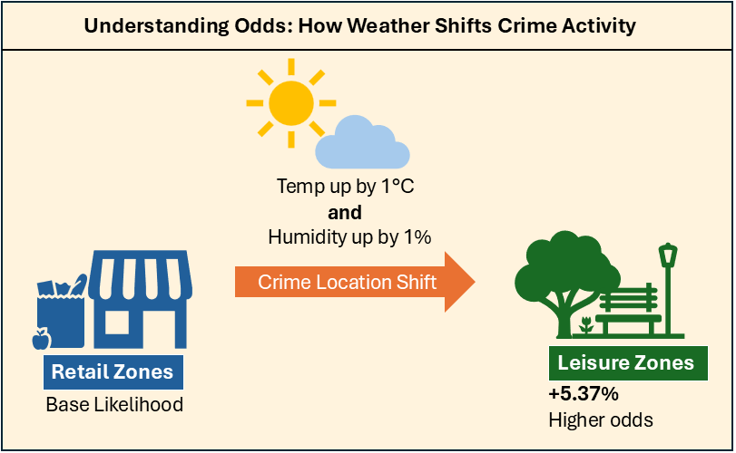

<!-- Some Bages -->

# Crimetology: How Weather Shifts Spatial Crime Patterns

A data science project investigating how weather influences crime occurrence across Leisure versus Retail areas.

## Executive Summary

Combining weather observations and open policing data enables a powerful dataset to test if temperature and relative humidity changes the likelihood of where crime occurs. 

By joining 1.26 million police records with gridded HadUK climate data, this project evaluates if weather drives crime towards outdoor leisure spaces versus commercial retail zones.

> **Key Finding:** Temperature and relative humidity exhibit a joint effect on the odds of where crime happens.    

__When considered together (Multivariate Model)__:  
Every 1°C increase in maximum temperature increases the odds of crime in a Leisure environment by 3.2%.     

Every 1% increase in relative humidity increases the odds of crime in a Leisure environment by 2.1%.  

When combines this increases the odds of crime events in Leisure zones by **5.37%**

__When considered separately (Univariate Models)__:  
Every 1°C increase in maximum temperature increases the odds of crime in a Leisure environment by 1.4%.  

Relative humidity changes have no statistically significant impact on odds.  

> This is a classic example of the *Suppressor Effect*. Temperature and humidity affect human behaviour together and push events into leisure zones. Therefore, we need two predictor variables to capture the odds properly. 

---

## Data Sources & Dataset

* Crime Data:
* Weather Data:

**Clean Project Data Availabililty** Zenodo repo

---

## Methodology & Project Workflow

### 1. Data Prep

### 2. Exploratory Data Analysis (EDA)
- *Key Insight 1:* 
- *Key Insight 2:* 

### 3. Modeling 

### 4. Results 

### 5. Evaluation & Conclusions

---

## Tech Stack & Tools
- Data Processing:
- Data Visualization:
- Machine Learning: ? 
- Environment:
